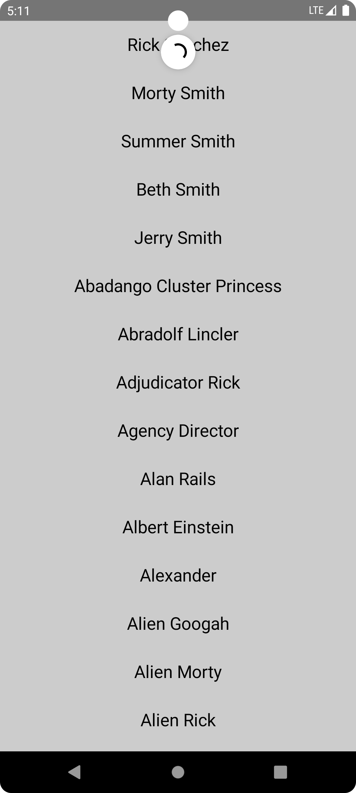

# NetworkCallDemoApp

  

## Medium Article

This project is accompanied by a Medium article titled "Android Compose Project with Retrofit, Pull-to-Refresh, Flow State & Hilt". You can read the article [here](https://medium.com/deuk/master-network-calls-and-modern-ui-in-android-compose-guide-to-the-networkcalldemoapp-4b59f80e1216).

## Overview

`NetworkCallDemoApp` is an Android project built using Jetpack Compose with network call capabilities. This project showcases the development of a dynamic and interactive UI that fetches and displays data from the [Rick and Morty API](https://rickandmortyapi.com/). The application demonstrates modern Android development practices focusing on clean architecture design.

Key features of the "NetworkCallDemoApp" include:

- Utilization of Retrofit for network requests, seamlessly integrated with a robust network data state management system to handle data loading, success, and error states.
- Implementation of a pull-to-refresh mechanism, closely coordinated with the ViewModel to ensure reactive UI updates and a smooth user experience. This mechanism allows users to manually refresh the data, providing immediate feedback and engagement.
- Advanced state management to distinguish between the initial data fetch and user-requested data refreshes. The app intelligently handles updating and loading states, ensuring users are always informed of the current data status through appropriate UI indicators.
- Integration of Dagger-Hilt for dependency injection, simplifying the architecture and promoting a scalable and maintainable codebase.
- Responsive and stateful UI components built with Jetpack Compose that react to user interactions and data state changes, offering an immersive and interactive user experience.

## Getting Started

1. Clone the repository to your local machine.
2. Open the project in Android Studio (preferably the latest version for full Compose support).
3. Run the app on an emulator or physical device to see the app in action.

## License

MIT License

Copyright (c) [2024] [Ken Ruiz Inoue]

Permission is hereby granted, free of charge, to any person obtaining a copy of this software and associated documentation files (the "Software"), to deal in the Software without restriction, including without limitation the rights to use, copy, modify, merge, publish, distribute, sublicense, and/or sell copies of the Software, and to permit persons to whom the Software is furnished to do so, subject to the following conditions:

The above copyright notice and this permission notice shall be included in all copies or substantial portions of the Software.

THE SOFTWARE IS PROVIDED "AS IS", WITHOUT WARRANTY OF ANY KIND, EXPRESS OR IMPLIED, INCLUDING BUT NOT LIMITED TO THE WARRANTIES OF MERCHANTABILITY, FITNESS FOR A PARTICULAR PURPOSE AND NONINFRINGEMENT. IN NO EVENT SHALL THE AUTHORS OR COPYRIGHT HOLDERS BE LIABLE FOR ANY CLAIM, DAMAGES OR OTHER LIABILITY, WHETHER IN AN ACTION OF CONTRACT, TORT OR OTHERWISE, ARISING FROM, OUT OF OR IN CONNECTION WITH THE SOFTWARE OR THE USE OR OTHER DEALINGS IN THE SOFTWARE.
